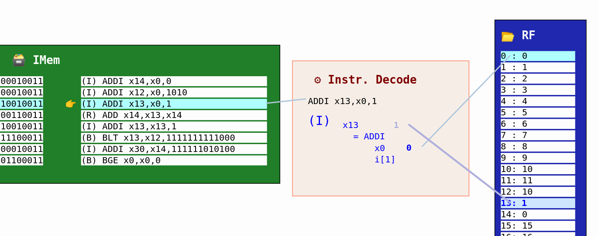

# Building my RISC-V CPU Core

Here I'll be saving all of my work while following the [Building a RISC-V CPU Core](https://www.edx.org/course/building-a-risc-v-cpu-core) [EdX](https://edx.org/) course by [Steve Hoover](https://www.linkedin.com/in/steve-hoover-a44b607/) of [Redwood EDA](https://redwoodeda.com), [Linux Foundation](https://www.linuxfoundation.org/), and [RISC-V International](https://riscv.org).
[Building a RISC-V CPU Core](https://www.edx.org/course/building-a-risc-v-cpu-core) [EdX](https://edx.org/) course by [Steve Hoover](https://www.linkedin.com/in/steve-hoover-a44b607/) of [Redwood EDA](https://redwoodeda.com), [Linux Foundation](https://www.linuxfoundation.org/), and [RISC-V International](https://riscv.org).

To see the code running, head towards [Makerchip's Official Website](http://makerchip.com/) and Launch the MakerChip IDE or simply just [click here](http://makerchip.com/sandbox/) and paste the code from [RISC-V_Subset_CPU.tlv](RISC-V_Subset_CPU.tlv) or [RISC-V_Complete_CPU.tlv](RISC-V_Complete_CPU.tlv) in the "EDITOR" tab of the IDE. Hit <Ctrl+Enter> to compile. And Enjoy... ;)

If this peaks your interest, and makes you curious... Then you might wanna:
  - Enroll in [Building a RISC-V CPU Core Course](https://www.edx.org/course/building-a-risc-v-cpu-core) for free.
  - Try the tutorials in [Makerchip](https://makerchip.com).
  - Learn more about [TL-Verilog](https://redwoodeda.com/tl-verilog).
  - Explore the [RISC-V](https://riscv.org) ecosystem.
  - Take [other courses](https://training.linuxfoundation.org/full-catalog/) from [Linux Foundation](https://www.linuxfoundation.org/)
  - Discover [other training](https://www.redwoodeda.com/publications) from [Redwood EDA](https://redwoodeda.com)
  - Get your core running on real hardware using FPGAs [in the cloud](https://github.com/stevehoover/1st-CLaaS) or [on your desktop](https://github.com/shivanishah269/risc-v-core/).
  - Install [TL-Verilog tools](https://www.redwoodeda.com/products).
  - Learn about the [WARP-V](https://github.com/stevehoover/warp-v) TL-Verilog CPU core generator.
